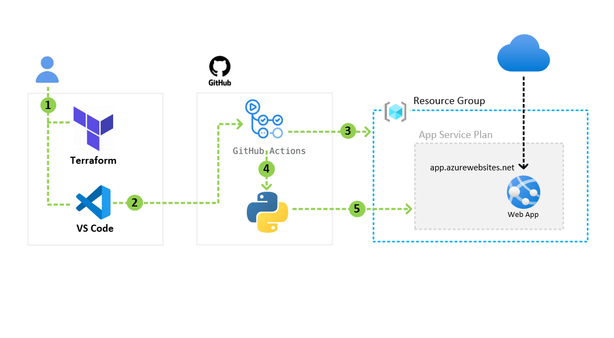

# Python App + Terraform + Pipelines using GitHub Actions

This project demonstrates an end-to-end cloud deployment pipeline using:

- Terraform (Infrastructure as Code)
- GitHub Actions (CI/CD)
- Azure App Service (Hosting)
- Python Flask (Web Application)


---

## Project Goals

The goal of this project is to demonstrate my foundational level skills with real world workflows including secure CI/CD Pipeline deployments in Azure using Terraform and GitHub Actions.

Here are the key skills demonstrated:

- Provisions Azure infrastructure using Terraform IaC
- Azure App Service Deployment
- Basic Python App (Flask) deployment
- CI/CD automated via GitHub Actions
- No manual Azure portal steps.
- Securing Azure Credentials

---

## Architecture Overview

This is a foundational architecture with a single Azure Web App Service to demonstrate the functional knowledge of deplying applications with Terraform and GitHub Actions.

1. Push code to GitHub
2. Pipeline runs Terraform
3. Infrastructure is created
4. App is deployed
5. Live URL is generated


---

## Enterprise Style Terraform Folder Structure

```text
terraform-python-webapp/
│
├── app/
│   ├── src/
│   │   └── app.py
│   ├── requirements.txt
│   └── startup.sh
│
├── terraform/
│   ├── main.tf
│   ├── variables.tf
│   ├── outputs.tf
│
├── .github/
│   └── workflows/
│       └── deploy.yml
│
├── .gitignore
└── README.md

```
---


## Author

Mickal Speller<br>
Cloud & Network Engineering Portfolio Project<br>
Focused on engineering secure, scalable Azure architecture with IaC, AzureDevOps and GitHub Actions with CI/CD Pipelines<br>
